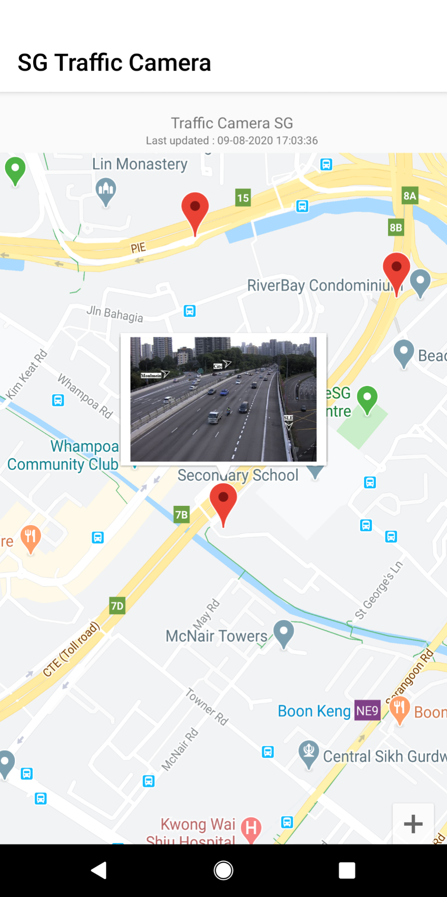
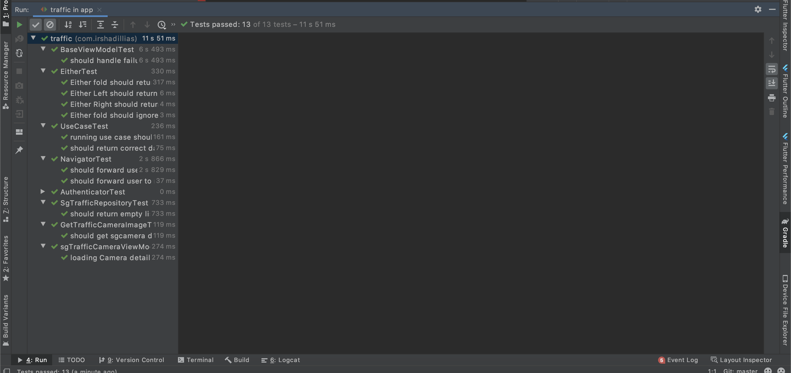

# Introduction
This application Using Google map for plotting Camera Location in Singapore. Application Using Google Map and Web api ("https://data.gov.sg/dataset/traffic-images")  For
Getting Location information and camera Image. 

  Assumption

  1. As per the web api Documentation need to refresh the map every 1 mint for every single mint for getting better user experience.
  2. Web required time stamp - As per the web api documentation, we need to pass the time stamp, even though we are not passing this param we will get the data.
     For safer side this application passing the device date to the web api.
     If user change mobile device date, it will trigger web api with that timestamp. It is not a good practices if we get the value from service then it will be good.

# Clean Code Advantages

Scalability.
Modularization.
Testability.
Independence of frameworks, UI and Databases.

# Code Architecture
This application uses MVVM Architecture, and kotlin DSL used instead of gradle. Whole code is modularized So feature can develop independently with the help of databinidng. Following libraries are used for

    1. Dagger
    2. Robolectric
    2. Rectrofit
    3. Coroutines
    4. okHttp
    5. Livedata

# Development Activity

Please use following Gradle/adb commands for executing this project:

 * `./gradlew runApp` - Builds and install the debug apk on the current connected device.
 * `./gradlew compileApp` - Builds the debug apk.
 * `./gradlew sgTrafficRunUnitTests` - Execute unit tests (both unit and integration).
 * `./gradlew sgTrafficRunAcceptanceTests` - Execute acceptance and instrumentation tests in the connected device.

#Test Result

